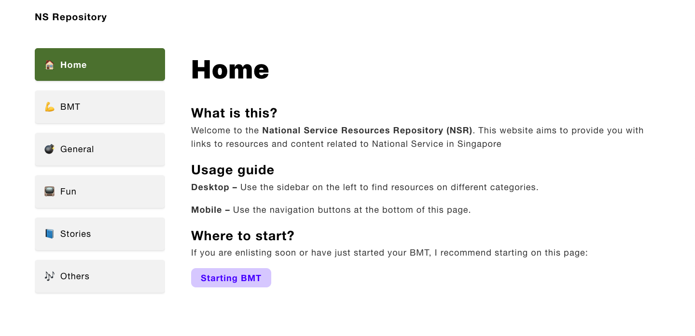
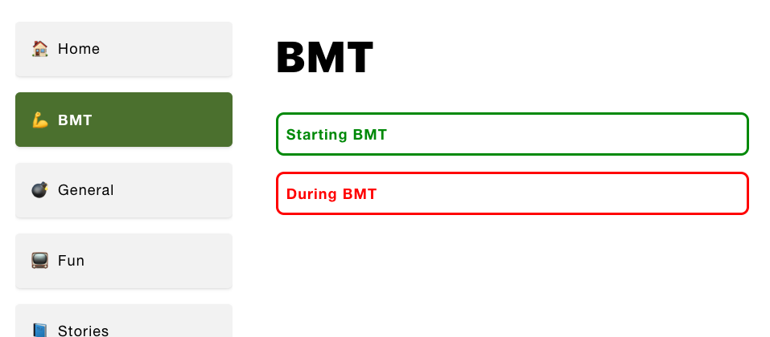
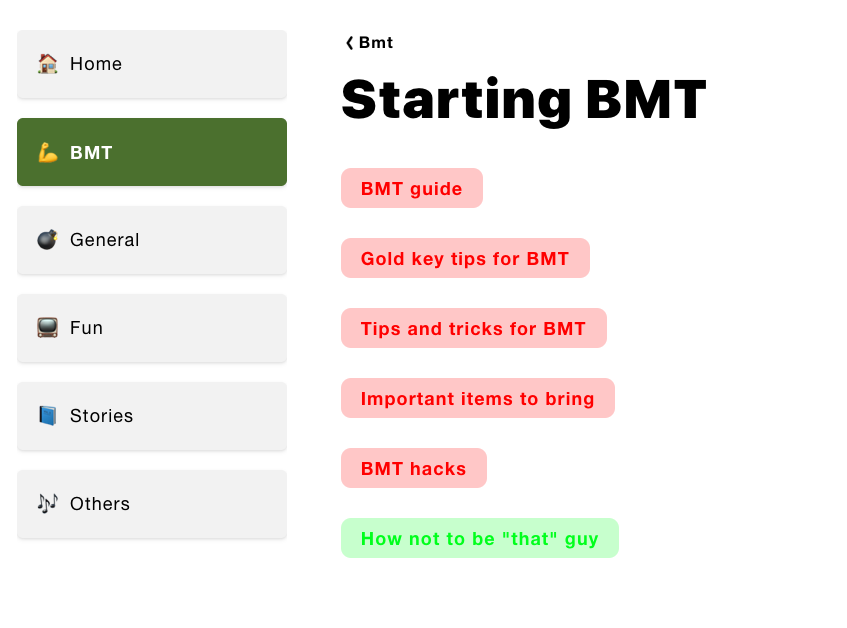
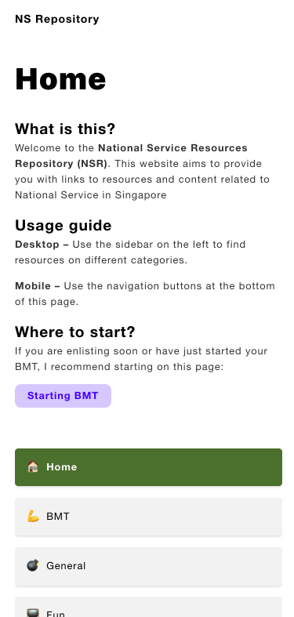

# [NS Repository (NSR)](http://nsr.now.sh/)

> A site that lists NS resources

## Gallery
|  | Starting page |
| -- | -- |
|  | Tag page (for BMT) |
|  | Links (resources) page (for BMT) |
|  | Mobile layout, with sidebar at bottom |

## Features
- [x] See differerent tags
  - [x] Show sidebar on desktop
- [x] Main page showing how to use the website
- [x] Each tag page has a list of different topics
  - [x] Each "topic" page has a list of links
- [ ] Make everything case insensitive (done, except for problems with captalization in "BMT" tag)

## Demo
[NSR](http://nsr.now.sh/)